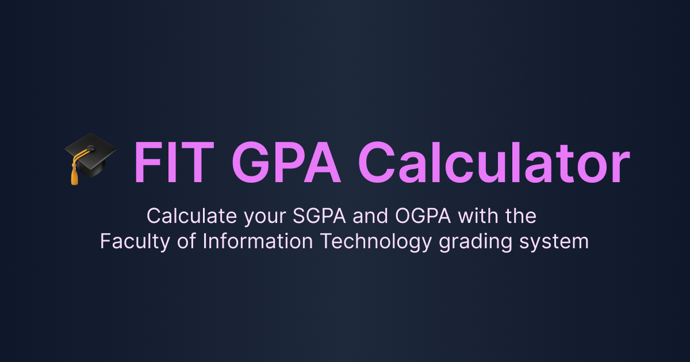

# 🎓 FIT GPA Calculator

Open-source GPA calculator for the Faculty of Information Technology, University of Moratuwa. Calculate SGPA and OGPA, store marks securely with local-only saving, and plan future grades. Your data remains private and is automatically saved, allowing you to close and reopen the app without losing progress.

🔗 [https://fit-gpa-calculator.vercel.app](https://fit-gpa-calculator.vercel.app)



## Features

- Calculate SGPA and OGPA based on the Faculty of Information Technology grading system.
- Automatically saves data locally, allowing you to close and reopen without losing progress.
- Add or remove semesters dynamically.
- Manage GPA records easily.
- Fast, responsive, and mobile-friendly.
- SEO optimized with social share preview.
- Open for contributions and feedback.

## 📦 Tech Stack

- **Next.js** 15 (App Router)
- **Tailwind CSS**
- **TypeScript**
- **Vercel** for deployment

## 🛠️ Getting Started

Clone the repository and run the development server:

```bash
git clone https://github.com/IshanHansaka/fit-gpa-calculator.git
cd fit-gpa-calculator
npm install
npm run dev
```
Open [http://localhost:3000](http://localhost:3000) to view it in the browser.

## 🤝 Contributing

Pull requests are welcome! Feel free to open issues or submit features.

1. Fork this repo
2. Create your feature branch:

```bash
git checkout -b feature/YourFeature
```

3. Commit your changes:

```bash
git commit -m 'feat: Add YourFeature'
```

4. Push to the branch:

```bash
git push origin feature/YourFeature
```

5. Open a pull request

## 📄 License

This project is licensed under the **[MIT License](https://opensource.org/licenses/MIT)**.

